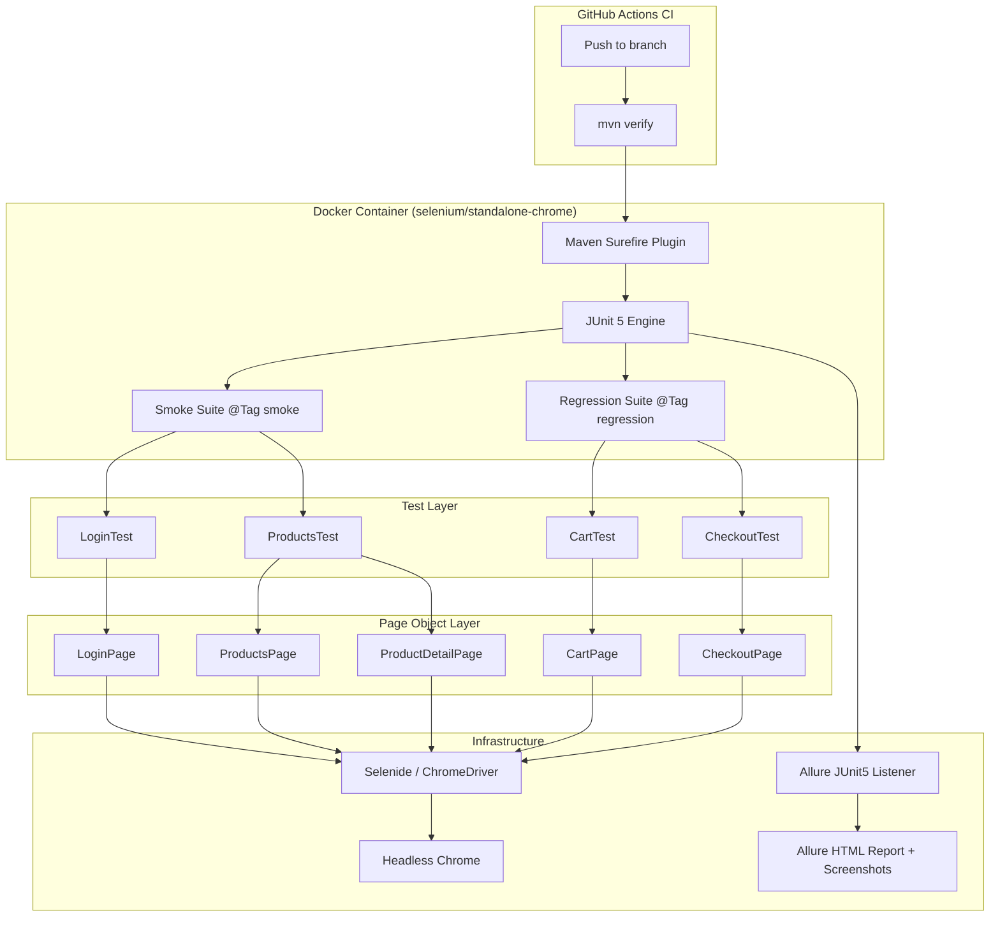

# Design Document

## Overview

This document describes the technical design for the Selenide UI test automation suite targeting [Swag Labs](https://www.saucedemo.com/). The suite is a Java/Maven project using Selenide (Selenium wrapper), JUnit 5, and Allure reporting. Tests are organized into smoke and regression suites via JUnit 5 `@Tag` annotations, run headlessly in Docker using `selenium/standalone-chrome`, and are triggered automatically via GitHub Actions.

The design follows the Page Object Model (POM) pattern: each application page is represented by a dedicated Java class that encapsulates selectors and interactions, keeping test classes free of raw Selenide/Selenium calls.

---

## Architecture



Key design decisions:

- Selenide is chosen over raw Selenium because it provides auto-waiting, concise `$()` selectors, and built-in screenshot support, reducing boilerplate significantly.
- JUnit 5 tags (`@Tag("smoke")`, `@Tag("regression")`) are used for suite separation rather than separate Maven modules, keeping the project structure flat and simple.
- Allure is chosen for reporting because it natively integrates with JUnit 5 via a listener, supports screenshot attachment, and produces rich HTML reports without custom code.
- `selenium/standalone-chrome` is used as the Docker base image because it bundles a compatible Chrome + ChromeDriver pair, eliminating version-mismatch issues.

---

## Components and Interfaces

### 1. Maven Project Configuration (`pom.xml`)

Manages all dependencies and plugin configuration.

Key dependencies:
- `com.codeborne:selenide` — browser automation
- `org.junit.jupiter:junit-jupiter` — test engine
- `io.qameta.allure:allure-junit5` — Allure JUnit 5 integration
- `io.qameta.allure:allure-selenide` — Allure Selenide listener (auto-attaches screenshots)
- `org.slf4j:slf4j-simple` — logging

Key plugins:
- `maven-surefire-plugin` (≥ 3.x) — runs JUnit 5 tests via `mvn test`; supports `-Dgroups=smoke` / `-Dgroups=regression` for tag filtering
- `allure-maven` — generates the Allure HTML report from raw results

### 2. Configuration (`src/test/resources/selenide.properties`)

```properties
selenide.baseUrl=https://www.saucedemo.com/
selenide.browser=chrome
selenide.headless=true
selenide.timeout=8000
```

Environment variables `SELENIDE_BASE_URL` and `SELENIDE_BROWSER` can override these at runtime (Docker / CI use case).

### 3. Base Test Class (`BaseTest.java`)

All test classes extend `BaseTest`. Responsibilities:
- `@BeforeEach`: open the base URL via `open("/")`, configure `ChromeOptions` for headless mode
- `@AfterEach`: call `closeWebDriver()` to release the browser
- Registers the `AllureSelenide` listener for automatic screenshot attachment on failure

```java
@BeforeEach
void setUp() {
    ChromeOptions options = new ChromeOptions();
    options.addArguments("--headless=new", "--no-sandbox", "--disable-dev-shm-usage");
    SelenideDriver / Configuration.browserCapabilities = options;
    open("/");
}
```

### 4. Page Objects (`src/test/java/.../pages/`)

| Class | Key Methods |
|---|---|
| `LoginPage` | `enterUsername(String)`, `enterPassword(String)`, `submit()`, `getErrorMessage(): String` |
| `ProductsPage` | `getProductNames(): List<String>`, `selectProduct(String)`, `getCartBadgeCount(): int` |
| `ProductDetailPage` | `getProductName(): String`, `getPrice(): String`, `getDescription(): String`, `addToCart()`, `backToProducts()` |
| `CartPage` | `getCartItemNames(): List<String>`, `removeItem(String)`, `isCartBadgeVisible(): boolean`, `proceedToCheckout()` |
| `CheckoutPage` | `enterShippingInfo(String firstName, String lastName, String zip)`, `continueCheckout()`, `getItemNames(): List<String>`, `getTotalPrice(): String`, `finishOrder()`, `getConfirmationMessage(): String`, `getErrorMessage(): String` |

All selectors use Selenide `$()` / `$$()`. No `Thread.sleep()` calls — Selenide's built-in polling handles waiting.

### 5. Test Classes (`src/test/java/.../tests/`)

| Class | Tags | Covers |
|---|---|---|
| `LoginTest` | `@Tag("smoke")` | Requirements 3.1–3.5 |
| `ProductsTest` | `@Tag("smoke")` | Requirements 4.1–4.4 |
| `CartTest` | `@Tag("regression")` | Requirements 5.1–5.4 |
| `CheckoutTest` | `@Tag("regression")` | Requirements 6.1–6.4 |

### 6. Screenshot Capture

Selenide's `AllureSelenide` listener (from `allure-selenide`) automatically:
- Captures a PNG screenshot on test failure
- Attaches it to the Allure report for the failing test
- Saves screenshots to `target/screenshots/` with the naming pattern `{TestClassName}_{testMethodName}_{timestamp}.png` via a JUnit 5 `TestWatcher` extension registered in `BaseTest`

### 7. Dockerfile

```dockerfile
FROM selenium/standalone-chrome:latest
USER root
RUN apt-get update && apt-get install -y maven
WORKDIR /app
COPY . .
RUN mvn dependency:resolve -q
CMD ["mvn", "verify"]
```

Environment variables `SELENIDE_BASE_URL` and `SELENIDE_BROWSER` are passed via `docker run -e`.

### 8. GitHub Actions Workflow (`.github/workflows/test.yml`)

Triggers on push to any branch. Steps:
1. Checkout code
2. Set up JDK 17
3. Run `mvn verify`
4. Upload `target/allure-results/`, `target/screenshots/`, and `target/site/allure-maven-plugin/` as artifacts
5. Notify on failure (Slack webhook via secret `SLACK_WEBHOOK_URL`)

---

## Data Models

### `TestCredentials` (constants / enum)

Credentials used across tests — not a runtime data model, but a shared constant class:

```java
public enum TestUser {
    STANDARD("standard_user", "secret_sauce"),
    LOCKED_OUT("locked_out_user", "secret_sauce"),
    INVALID("bad_user", "bad_pass");

    public final String username;
    public final String password;
}
```

### `ProductInfo` (value record — used in assertions)

```java
public record ProductInfo(String name, String price, String description) {}
```

Used by `ProductDetailPage` to return a snapshot of displayed product data for assertion in tests.

### `ShippingInfo` (value record — used in checkout tests)

```java
public record ShippingInfo(String firstName, String lastName, String postalCode) {}
```

Used by `CheckoutPage.enterShippingInfo()` to keep method signatures clean.

### Allure Report Metadata

Each test method is annotated with:
- `@Story` — maps to the user story (e.g., "Login Functionality")
- `@Severity` — `CRITICAL` for smoke, `NORMAL` for regression
- `@Description` — brief description of what the test validates

---

## Correctness Properties

*A property is a characteristic or behavior that should hold true across all valid executions of a system — essentially, a formal statement about what the system should do. Properties serve as the bridge between human-readable specifications and machine-verifiable correctness guarantees.*

### Property 1: Invalid credentials always produce an error message

*For any* username/password pair that is not a valid Swag Labs credential (including empty username, empty password, or a locked-out user), submitting the login form should result in a non-empty error message being displayed on the login page.

**Validates: Requirements 3.2, 3.3, 3.4, 3.5**

---

### Property 2: Product detail page reflects the selected product

*For any* product name displayed on the Products_Page, navigating to that product's detail page should show the same product name and a price string matching the format `$X.XX` (i.e., a dollar sign followed by one or more digits, a decimal point, and exactly two digits).

**Validates: Requirements 4.2, 4.3**

---

### Property 3: Cart contents match added products

*For any* non-empty set of products added from the Products_Page, the Cart_Page should display exactly those product names — no more, no fewer.

**Validates: Requirements 5.1, 5.2**

---

### Property 4: Removing an item from the cart excludes it from the cart list

*For any* item present in the cart, after removing that item, the Cart_Page item list should not contain that item's name.

**Validates: Requirements 5.3**

---

### Property 5: Empty cart has no visible badge

*For any* cart state, after all items have been removed, the cart badge in the page header should not be visible.

**Validates: Requirements 5.4**

---

### Property 6: Order summary contains all cart items

*For any* set of products added to the cart and any valid shipping information submitted, the checkout order summary page should display all of the product names that were in the cart.

**Validates: Requirements 6.2**

---

### Property 7: Screenshot file name matches the required pattern

*For any* failing test identified by its class name and method name, the screenshot file saved to `target/screenshots/` should have a name matching the pattern `{TestClassName}_{testMethodName}_{timestamp}.png`.

**Validates: Requirements 9.2**

---

### Property 8: Test report includes counts for all outcome categories

*For any* test run, the generated Allure report should include a non-negative integer count for each of: tests run, tests passed, tests failed, and tests skipped, and the sum of passed + failed + skipped should equal tests run.

**Validates: Requirements 10.2**

---

### Property 9: Failed test report entries include failure details

*For any* test that fails, the corresponding entry in the Allure report should include a non-empty failure message and a non-empty stack trace.

**Validates: Requirements 10.3**

---

## Error Handling

### Browser / Driver Errors

- If ChromeDriver fails to start (e.g., version mismatch), Selenide throws a `WebDriverException`. The `BaseTest.setUp()` method does not catch this — it propagates and JUnit 5 marks the test as errored (not failed), which is the correct behavior. The CI pipeline will mark the build as failed.
- If the base URL is unreachable, Selenide's `open()` will throw. Tests will error out immediately, making the root cause obvious in the report.

### Element Not Found / Timeout

- Selenide's built-in polling waits up to `selenide.timeout` (default 8 s) before throwing `ElementNotFound`. This replaces all explicit waits. Tests that hit this exception will fail with a clear message and an automatic screenshot.
- No `Thread.sleep()` calls are permitted in page objects or test classes.

### Screenshot Capture Failures

- If `target/screenshots/` does not exist, the `TestWatcher` extension creates it before writing. If the directory cannot be created (e.g., permission error in Docker), the exception is logged but does not fail the test — the test result is preserved.

### Checkout Form Validation Errors

- `CheckoutPage.getErrorMessage()` returns an empty string if no error element is present, allowing tests to assert on the absence of errors without throwing.

### Docker Exit Codes

- `mvn verify` exits with code `0` on full pass and a non-zero code on any test failure or build error. The `CMD` in the Dockerfile uses this directly — no wrapper script needed.

### CI Notification Failures

- If the Slack webhook call fails (e.g., invalid secret), the GitHub Actions step is marked as a warning but does not block the overall pipeline result. The build failure status is still correctly reported by the `mvn verify` exit code.

---

## Testing Strategy

### Dual Testing Approach

Both unit/example tests and property-based tests are used. They are complementary:

- **Example tests** verify specific known scenarios (e.g., valid login navigates to products page, confirmation message text).
- **Property tests** verify universal rules across generated inputs (e.g., any invalid credential produces an error, any added product appears in the cart).

### Unit / Example Tests

Implemented with JUnit 5. Focus areas:
- Specific happy-path scenarios (valid login, successful checkout)
- Known error messages (locked-out user, empty fields)
- Structural checks (pom.xml dependencies, selenide.properties content, Dockerfile base image)
- Integration points (Allure screenshot attachment, CI artifact upload)

Avoid writing redundant example tests for behaviors already covered by property tests.

### Property-Based Tests

**Library**: [jqwik](https://jqwik.net/) — a JUnit 5-native property-based testing library for Java. It integrates directly with the JUnit 5 engine (no separate runner needed) and supports `@Property`, `@ForAll`, and custom `@Provide` arbitraries.

**Configuration**: Each `@Property` test runs a minimum of **100 tries** (`tries = 100`).

**Tag format for each property test**:
```
// Feature: selenide-ui-test-automation, Property N: <property_text>
```

#### Property Test Implementations

**Property 1 — Invalid credentials always produce an error message**
```java
// Feature: selenide-ui-test-automation, Property 1: invalid credentials always produce an error message
@Property(tries = 100)
void invalidCredentialsShowError(@ForAll @From("invalidCredentials") TestCredentials creds) {
    LoginPage loginPage = new LoginPage();
    loginPage.enterUsername(creds.username()).enterPassword(creds.password()).submit();
    assertThat(loginPage.getErrorMessage()).isNotEmpty();
}
// Arbitraries.strings() for username/password, excluding the known valid pair
```

**Property 2 — Product detail page reflects the selected product**
```java
// Feature: selenide-ui-test-automation, Property 2: product detail page reflects selected product
@Property(tries = 6) // catalog has exactly 6 products
void productDetailMatchesSelection(@ForAll @From("productNames") String productName) {
    ProductsPage productsPage = new ProductsPage();
    productsPage.selectProduct(productName);
    ProductDetailPage detail = new ProductDetailPage();
    assertThat(detail.getProductName()).isEqualTo(productName);
    assertThat(detail.getPrice()).matches("\\$\\d+\\.\\d{2}");
}
```

**Property 3 — Cart contents match added products**
```java
// Feature: selenide-ui-test-automation, Property 3: cart contents match added products
@Property(tries = 100)
void cartContainsAllAddedProducts(@ForAll @Size(min=1, max=6) List<@From("productNames") String> products) {
    // add each product, navigate to cart, assert all names present
}
```

**Property 4 — Removing an item excludes it from the cart list**
```java
// Feature: selenide-ui-test-automation, Property 4: removing item excludes it from cart
@Property(tries = 100)
void removedItemNotInCart(@ForAll @From("productNames") String product) {
    // add product, go to cart, remove it, assert not in list
}
```

**Property 5 — Empty cart has no visible badge**
```java
// Feature: selenide-ui-test-automation, Property 5: empty cart has no visible badge
@Property(tries = 100)
void emptyCartHasNoBadge(@ForAll @Size(min=1, max=6) List<@From("productNames") String> products) {
    // add all, remove all, assert badge not visible
}
```

**Property 6 — Order summary contains all cart items**
```java
// Feature: selenide-ui-test-automation, Property 6: order summary contains all cart items
@Property(tries = 100)
void orderSummaryContainsCartItems(
    @ForAll @Size(min=1, max=3) List<@From("productNames") String> products,
    @ForAll @From("validShippingInfo") ShippingInfo shipping) {
    // add products, checkout, assert all product names in summary
}
```

**Property 7 — Screenshot file name matches pattern**
```java
// Feature: selenide-ui-test-automation, Property 7: screenshot file name matches pattern
@Property(tries = 100)
void screenshotNameMatchesPattern(
    @ForAll @AlphaChars @StringLength(min=1, max=50) String className,
    @ForAll @AlphaChars @StringLength(min=1, max=50) String methodName) {
    String filename = ScreenshotNamer.buildName(className, methodName);
    assertThat(filename).matches(className + "_" + methodName + "_\\d+\\.png");
}
```

**Property 8 — Report counts are consistent**
```java
// Feature: selenide-ui-test-automation, Property 8: report counts are consistent
@Property(tries = 100)
void reportCountsAreConsistent(@ForAll @From("testRunSummaries") TestRunSummary summary) {
    assertThat(summary.passed() + summary.failed() + summary.skipped())
        .isEqualTo(summary.total());
}
```

**Property 9 — Failed test entries include failure details**
```java
// Feature: selenide-ui-test-automation, Property 9: failed test entries include failure details
@Property(tries = 100)
void failedTestEntryHasDetails(@ForAll @From("failedTestResults") AllureTestResult result) {
    assertThat(result.failureMessage()).isNotEmpty();
    assertThat(result.stackTrace()).isNotEmpty();
}
```

### Test Execution Commands

```bash
# Run all tests
mvn verify

# Run smoke suite only
mvn verify -Dgroups=smoke

# Run regression suite only
mvn verify -Dgroups=regression

# Generate and open Allure report
mvn allure:serve
```

### Coverage Summary

| Requirement | Example Tests | Property Tests |
|---|---|---|
| 1 (Project Setup) | ✓ pom.xml structure checks | — |
| 2 (Page Objects) | ✓ API contract checks | — |
| 3 (Login) | ✓ valid login, locked-out | Property 1 (invalid creds) |
| 4 (Products) | ✓ product count, add-to-cart badge | Property 2 (detail page) |
| 5 (Cart) | — | Properties 3, 4, 5 |
| 6 (Checkout) | ✓ form fields, confirmation message | Property 6 (order summary) |
| 7 (Smoke Suite) | ✓ tag presence, suite composition | — |
| 8 (Regression Suite) | ✓ tag presence, suite composition | — |
| 9 (Screenshots) | ✓ file existence, Allure attachment | Property 7 (naming pattern) |
| 10 (Reporting) | ✓ report file existence | Properties 8, 9 |
| 11 (Docker) | ✓ Dockerfile structure, env vars | — |
| 12 (CI/CD) | ✓ workflow YAML structure | — |
